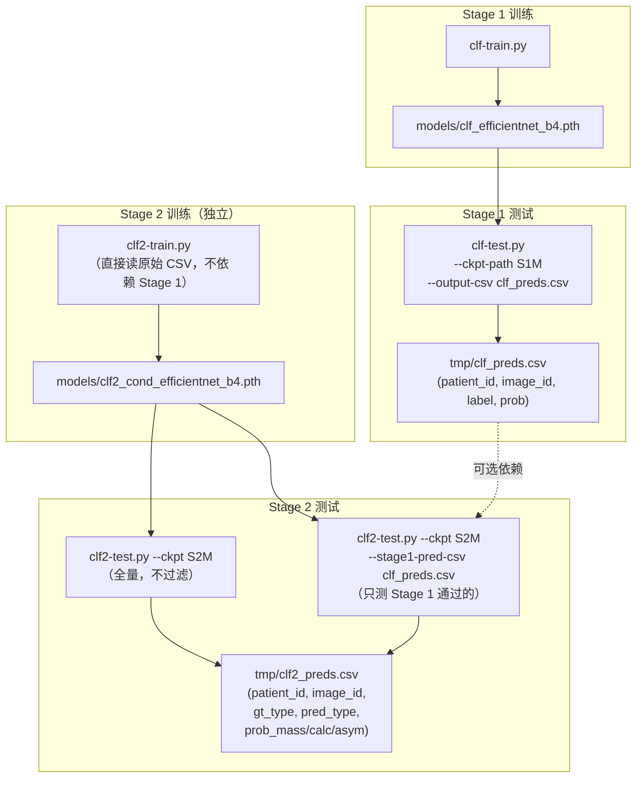

# MammoPearl 深度学习分类系统

> **数据集**：VinDr Mammography（经处理版本）
>
> **方法**：EfficientNet-B4（ImageNet 预训练）两阶段分类流水线
>
> **代码目录**：`src/data/deep-learning/`

---

## 一、整体架构

```
原始乳腺 X 光图像（512×512 RGB）
  │
  ▼
[Stage 1] 图像级二分类筛查
  ├─ 阴性（prob < 阈值）→ 排除，无需进一步分析
  └─ 疑似阳性（prob ≥ 阈值）→ 进入 Stage 2
  │
  ▼
[Stage 2] 3 类条件病变类型分类（仅对阳性图像）
  ├─ 0: Mass（肿块）
  ├─ 1: Calcification（可疑钙化）
  └─ 2: Asymmetry_Distortion（不对称/结构扭曲，含 Skin_Other）
```

设计原则：
- **Stage 1 高召回优先**：宁可多报也不漏，@阈值 0.10 时召回率 ≥ 95%。
- **Stage 2 条件分类**：仅在阳性图像上区分 3 种病变类型（Mass/Calc/Asym），不含 No Finding 类；模型只见阳性样本，类别平衡更好，特征空间不被无病变图像占据。
- **两个模型独立训练**：Stage 2 不依赖 Stage 1 的权重，仅在推理/测试时通过预测 CSV 串联。

---

## 二、数据集说明

| 项目 | 内容 |
|------|------|
| 原始 CSV | `data/raw/vindr_detection_folds.csv`（约 20,486 行） |
| 图像路径 | `data/processed/images_png/<patient_id>/<image_id>.png` |
| 划分方式 | 患者级别，零重叠 |
| 训练集 | ~16,000 张（split="training"），5 折交叉验证 |
| 测试集 | ~4,000 张（split="test"） |
| 关键标签列 | `has_lesion`（Stage 1），`finding_categories`（Stage 2） |

**Stage 1 标签分布**

| 标签 | 训练集 | 测试集 |
|------|--------|--------|
| 0（阴性） | ~14,600 | 3,643 |
| 1（阳性） | ~1,400  | 357   |

**Stage 2 标签分布（3 类，仅阳性图像）**

| 标签 | 含义 | 原始 finding_categories | 训练集（fold 0 out） | 验证集（fold 0） | 测试集 |
|------|------|-------------------------|----------------------|-----------------|--------|
| 0 | Mass | Mass | 614 | 203 | 197 |
| 1 | Calcification | Suspicious Calcification | 147 | 70 | 74 |
| 2 | Asymmetry_Distortion | Architectural Distortion、Asymmetry、Focal Asymmetry、Global Asymmetry、Skin_Other（合并） | 300 | 77 | 86 |

**多病变图像处理规则**：CSV 中同一图像可能同时有多个 finding，取优先级最高者作为唯一标签：
**Mass（最高）> Calcification > Asymmetry_Distortion（最低）**。

---

## 三、代码文件说明

```
src/data/deep-learning/
├── dataset.py         # 公共数据集工具（两阶段共用）
├── clf-train.py       # Stage 1 训练脚本
├── clf-test.py        # Stage 1 测试脚本
├── clf2-train.py      # Stage 2 训练脚本
├── clf2-test.py       # Stage 2 测试脚本
├── use.py             # 推理接口
└── use_example.py     # 推理使用示例
```

| 文件 | 作用 |
|------|------|
| `dataset.py` | 公共数据加载工具，提供两阶段 DataFrame 构建、`MammoDataset` 类与采样权重计算 |
| `clf-train.py` | Stage 1 EfficientNet-B4 二分类训练；导出 `build_model`、`evaluate` 供 `clf-test.py` 动态导入 |
| `clf-test.py` | Stage 1 多阈值评估；可选 GradCAM 可视化（`--vis-dir`）与预测 CSV 输出（`--output-csv`） |
| `clf2-train.py` | Stage 2, 3 类条件分类训练（Mass/Calc/Asym，仅阳性图）；导出 `build_stage2_model`、`evaluate_stage2` 供 `clf2-test.py` 动态导入 |
| `clf2-test.py` | Stage 2 阳性图评估；可选 Stage 1 预测 CSV 过滤（`--stage1-pred-csv`）与预测 CSV 输出 |
| `use.py` | 独立推理接口，封装两阶段推理流程；提供 `MammoPearlPredictor` 类（批量）和 `predict()` 便捷函数（单次） |
| `use_example.py` | 可直接执行的推理示例，演示 `MammoPearlPredictor` 批量用法、字节流输入和 `predict()` 调用 |

---

## 四、文件与产出物依赖关系



> 实线箭头为数据/文件的输入输出关系，虚线为可选依赖（仅在使用 `--stage1-pred-csv` 时需要）。

**源码级依赖**（import 关系）：

| 脚本 | 依赖文件 | 依赖方式 |
|------|----------|----------|
| `clf-train.py` | `dataset.py` | 直接 import |
| `clf-test.py` | `dataset.py` | 直接 import |
| `clf-test.py` | `clf-train.py` | 动态 import（`importlib`） |
| `clf2-train.py` | `dataset.py` | 直接 import |
| `clf2-test.py` | `dataset.py` | 直接 import |
| `clf2-test.py` | `clf2-train.py` | 动态 import（`importlib`） |

---

## 五、完整训练-测试闭环命令

### 5.1 Stage 1

```bash
# ── 训练 ────────────────────────────────────────────────────────────────────
python src/data/deep-learning/clf-train.py \
    --epochs 30 \
    --batch-size 16 \
    --lr 1e-4 \
    --encoder-lr-multiplier 0.1 \
    --input-h 512 \
    --input-w 512 \
    --fold-val 0 \
    --patience 8 \
    --save-path models/clf_efficientnet_b4.pth \
    --amp \
    --augment

# ── 测试（多阈值评估 + 预测 CSV）─────────────────────────────────────────────
python src/data/deep-learning/clf-test.py \
    --ckpt-path models/clf_efficientnet_b4.pth \
    --output-csv tmp/clf_preds.csv

# ── 测试（附带 GradCAM 可视化，适合小批量抽查）────────────────────────────────
python src/data/deep-learning/clf-test.py \
    --ckpt-path models/clf_efficientnet_b4.pth \
    --output-csv tmp/clf_preds.csv \
    --vis-dir tmp/gradcam \
    --score-threshold 0.5
```

### 5.2 Stage 2

```bash
# ── 训练 ────────────────────────────────────────────────────────────────────
python src/data/deep-learning/clf2-train.py \
    --epochs 30 \
    --batch-size 16 \
    --lr 1e-4 \
    --encoder-lr-multiplier 0.1 \
    --input-h 512 \
    --input-w 512 \
    --fold-val 0 \
    --patience 10 \
    --save-path models/clf2_cond_efficientnet_b4.pth \
    --amp \
    --augment

# ── 测试（全量阳性图评估，不依赖 Stage 1）────────────────────────────────────
python src/data/deep-learning/clf2-test.py \
    --ckpt-path models/clf2_cond_efficientnet_b4.pth \
    --output-csv tmp/clf2_preds.csv

# ── 测试（模拟完整流水线：仅评估 Stage 1 通过的阳性图像）──────────────────────
python src/data/deep-learning/clf2-test.py \
    --ckpt-path models/clf2_cond_efficientnet_b4.pth \
    --stage1-pred-csv tmp/clf_preds.csv \
    --stage1-threshold 0.1 \
    --output-csv tmp/clf2_preds.csv
```

### 5.3 完整流水线（按顺序执行）

```bash
# Step 1: Stage 1 训练
python src/data/deep-learning/clf-train.py \
    --epochs 30 --batch-size 16 --lr 1e-4 \
    --encoder-lr-multiplier 0.1 --input-h 512 --input-w 512 \
    --fold-val 0 --patience 8 \
    --save-path models/clf_efficientnet_b4.pth \
    --amp --augment

# Step 2: Stage 1 测试（生成供 Stage 2 过滤用的预测 CSV）
python src/data/deep-learning/clf-test.py \
    --ckpt-path models/clf_efficientnet_b4.pth \
    --output-csv tmp/clf_preds.csv

# Step 3: Stage 2 训练（独立，不依赖 Step 1/2）
# 可与 Step 1/2 并行运行
python src/data/deep-learning/clf2-train.py \
    --epochs 30 --batch-size 16 --lr 1e-4 \
    --encoder-lr-multiplier 0.1 --input-h 512 --input-w 512 \
    --fold-val 0 --patience 10 \
    --save-path models/clf2_cond_efficientnet_b4.pth \
    --amp --augment

# Step 4: Stage 2 测试（模拟完整流水线）
python src/data/deep-learning/clf2-test.py \
    --ckpt-path models/clf2_cond_efficientnet_b4.pth \
    --stage1-pred-csv tmp/clf_preds.csv \
    --stage1-threshold 0.1 \
    --output-csv tmp/clf2_preds.csv
```

> **提示**：Step 1/2 与 Step 3 可并行训练（两个模型不互相依赖），  
> 只有 Step 4 必须等待 Step 2（获得 `tmp/clf_preds.csv`）和 Step 3 完成后才能运行。

---

## 六、完整运行后的所有产出物

| 产出物路径 | 生成步骤 | 内容描述 |
|-----------|----------|----------|
| `models/clf_efficientnet_b4.pth` | Stage 1 训练 | 最优 val F2 的 Stage 1 checkpoint |
| `models/clf_efficientnet_b4.history.json` | Stage 1 训练 | 每轮 loss/lr/val 指标历史 |
| `models/clf2_cond_efficientnet_b4.pth` | Stage 2 训练 | 最优 lesion macro F1 的 Stage 2 条件分类器 checkpoint |
| `models/clf2_cond_efficientnet_b4.history.json` | Stage 2 训练 | 每轮 loss/lr/val 指标历史 |
| `tmp/clf_preds.csv` | Stage 1 测试 | 每张测试图的预测概率（patient_id, image_id, label, prob） |
| `tmp/gradcam/*.jpg`（可选） | Stage 1 测试 | GradCAM 热力图可视化（高置信度预测） |
| `tmp/clf2_preds.csv` | Stage 2 测试 | 每张测试图的预测类型（patient_id, image_id, gt_type, pred_type, prob_mass, prob_calc, prob_asym） |

**Checkpoint 文件命名说明**

| 文件名组成部分 | 含义 |
|--------------|------|
| `clf` | Stage 1 分类器（classifier，二分类） |
| `clf2` | Stage 2 分类器（stage-2 classifier，3 类） |
| `cond` | 条件分类器（conditional），仅对 Stage 1 判为阳性的图像运行 |
| `efficientnet_b4` | 主干网络架构（EfficientNet-B4） |

---

## 七、模型架构说明

两个阶段均使用 **EfficientNet-B4**（torchvision，ImageNet 预训练），
仅分类头不同：

| | Stage 1 | Stage 2 |
|--|---------|---------|
| 输入通道 | 3（RGB）或 4（RGB + GT mask） | 3（RGB） |
| 分类头输出 | 1 logit | 3 logits |
| 损失函数 | BCEWithLogitsLoss（pos_weight=1.0） | CrossEntropyLoss（uniform weight） |
| 类别平衡 | WeightedRandomSampler | WeightedRandomSampler |
| 输入尺寸 | 512×512（letterbox 缩放） | 512×512（letterbox 缩放） |
| 优化器 | AdamW（backbone lr × 0.1，head 全速 lr） | AdamW（backbone lr × 0.1，head 全速 lr） |
| 调度器 | CosineAnnealingLR | CosineAnnealingLR |
| Checkpoint 判据 | 动态最优阈值下的 val F2（过滤全正退化态） | Mass/Calc/Asym 全部 3 类的 macro F1 |

---

## 八、训练结果参考

### Stage 1（Epoch 22，30 轮最优）

> 测试集共 4,000 张（阳性 357，阴性 3,643）。各列含义：
> **Thr**=决策阈值；**Recall**=召回率；**Prec**=精确率；**F2**=F2 分数（召回权重更高）；
> **TP/FP/FN**=真阳/假阳/假阴数量。

| Thr | Recall | Prec | F1 | F2 | TP | FP | FN |
|-----|--------|------|-----|-----|-----|------|-----|
| 0.10 | 95.52% | 10.80% | 19.41% | 37.19% | 341 | 2816 | 16 |
| 0.20 | 83.75% | 14.75% | 25.08% | 43.27% | 299 | 1728 | 58 |
| 0.30 | 72.83% | 19.16% | 30.34% | 46.68% | 260 | 1097 | 97 |
| **0.40** | **63.31%** | **24.30%** | **35.12%** | **47.92%** | **226** | **704** | **131** |
| 0.50 | 50.98% | 28.17% | 36.29% | 43.88% | 182 | 464 | 175 |
| 0.60 | 42.30% | 33.71% | 37.52% | 40.25% | 151 | 297 | 206 |
| 0.70 | 34.45% | 41.84% | 37.79% | 35.71% | 123 | 171 | 234 |
| 0.80 | 27.17% | 50.00% | 35.21% | 29.90% | 97 | 97 | 260 |
| 0.90 | 18.21% | 64.36% | 28.38% | 21.26% | 65 | 36 | 292 |

> @0.10 高召回工作点：漏检 16 张（总 357 张阳性），可作为 Stage 2 的输入。  
> @0.40 为最优 F2 工作点（0.479），精确率与召回率最佳折衷。

### Stage 2（条件分类器，仅阳性图像，fold=0，Epoch 6）

> 各列含义：**N**=该类的真实样本数；**Recall**=该类的召回率（正确识别的比例）；
> **Precision**=该类的精确率（预测为该类中实际正确的比例）；**F1**=召回与精确的调和平均。

**验证集（350 张阳性）：**

| 类别 | N | Recall | Precision | F1 |
|------|---|--------|-----------|-----|
| Mass | 203 | 0.547 | 0.564 | 0.555 |
| Calcification | 70 | 0.314 | 0.214 | 0.254 |
| Asymmetry_Distortion | 77 | 0.195 | 0.300 | 0.236 |
| **Macro** | — | — | — | **0.348** |

**测试集（全量阳性 357 张）：**

| 类别 | N | Recall | Precision | F1 |
|------|---|--------|-----------|-----|
| Mass | 197 | 0.599 | 0.576 | 0.587 |
| Calcification | 74 | 0.432 | 0.286 | 0.344 |
| Asymmetry_Distortion | 86 | 0.116 | 0.250 | 0.159 |
| **Macro** | — | — | — | **0.363** |

**测试集（Stage 1 过滤 @0.10，341/357 通过）：**

| 类别 | N | Recall | Precision | F1 |
|------|---|--------|-----------|-----|
| Mass | 185 | 0.622 | 0.575 | 0.597 |
| Calcification | 72 | 0.417 | 0.297 | 0.347 |
| Asymmetry_Distortion | 84 | 0.119 | 0.250 | 0.161 |
| **Macro** | — | — | — | **0.368** |

端到端正确分类率（Stage 1 通过 且 Stage 2 类型正确）：Mass 58.4%，Calc 40.5%，Asym 11.6%。
Asymmetry_Distortion 是全图级最难识别的病变类型（召回率 12%），Mass 和 Calc 均有显著改善。

---

## 九、常见问题

### Q1：为什么 Stage 2 只用阳性图像训练？

Stage 2 是**条件分类器**：它的输入前提已经是"Stage 1 判断为疑似阳性"的图像，
任务只是区分 Mass / Calcification / Asymmetry_Distortion 三种病变类型。

用全部图像（含 ~91% No Finding）训练会导致：
1. No Finding 样本占据绝大多数特征空间，病变类特征学习不足；
2. Softmax 中 No Finding 的高置信度会系统性地压制所有病变类概率；
3. 少数病变类（Calc 仅 147 张）无论怎样上采样，特征层仍然欠拟合。

仅用阳性图像训练后，三类样本数比为 614:147:300，类别平衡问题大幅改善。

### Q2：分割（Segment）模块与分类流水线的关系是什么？是否有必要使用？

**分割模块做什么**

`src/data/segment/segment.py` 是独立的预处理工具，与分类训练脚本分离。
它先用 FasterRCNN（`models/bbox.pth`）检测病灶 bbox，再在 bbox 区域内
用阈值 + 形态学方法提取前景 mask，产出的二值 mask 保存至
`data/segmented/mask/<patient_id>/<image_id>.png`，对应的裁剪基底图保存至 `data/segmented/base/`。

**如何把分割结果引入分类训练**

Stage 1（`clf-train.py`）提供了 `--use-gt-mask` 开关，启用后会以
**标注文件中的 GT bbox** 直接绘制二值 mask，作为第 4 输入通道附加到模型（`in_channels=4`）。
这与 `segment.py` 的产出不同——前者直接从 CSV 标注坐标绘制，后者需要先跑检测模型再做图像处理。

示例命令（GT mask 模式，仅用于实验）：

```bash
python src/data/deep-learning/clf-train.py \
    --epochs 30 --batch-size 16 --lr 1e-4 \
    --encoder-lr-multiplier 0.1 --input-h 512 --input-w 512 \
    --fold-val 0 --patience 8 \
    --save-path models/clf_efficientnet_b4_mask.pth \
    --amp --augment \
    --use-gt-mask
```

**为什么当前流水线不使用**

1. **GT mask 无法用于生产推理**：`--use-gt-mask` 要求训练和测试均提供 GT bbox，但真实推理时没有标注信息。若测试时把第 4 通道置零，会造成训练/测试分布不一致，实际泛化性反而下降。因此该模式仅适合衡量 GT 引导效果的上界实验。
2. **`segment.py` 的 predicted mask 引入额外依赖**：需要先运行 bbox 检测模型得到坐标，再生成 mask，再送入分类模型。一旦检测模型漏检（阴性图 bbox 为空），mask 全零，帮助有限；同时也增加了推理链路的复杂度和潜在失败点。
3. **Stage 2 不需要**：Stage 2 的输入已经是 Stage 1 过滤后的疑似阳性图，病变信息相对集中。Asymmetry_Distortion 召回率低（~12%）的根本原因在于全图级的细微对称差异难以捕捉，粗粒度的 bbox mask 对此帮助有限。

**结论**：在当前数据规模和模型配置下，不使用分割特征是合理的。
如需探索上限，建议先用 `--use-gt-mask` 做对照实验验证收益，
再决定是否值得接入 `segment.py` 的预测 mask 以支持端到端可部署的版本。

### Q3：两个模型可以同时训练吗？

可以。两个模型训练时互相独立（分别读取原始 CSV）。
只有 Stage 2 测试的"过滤模式"需要等 Stage 1 测试产出 `tmp/clf_preds.csv`。
