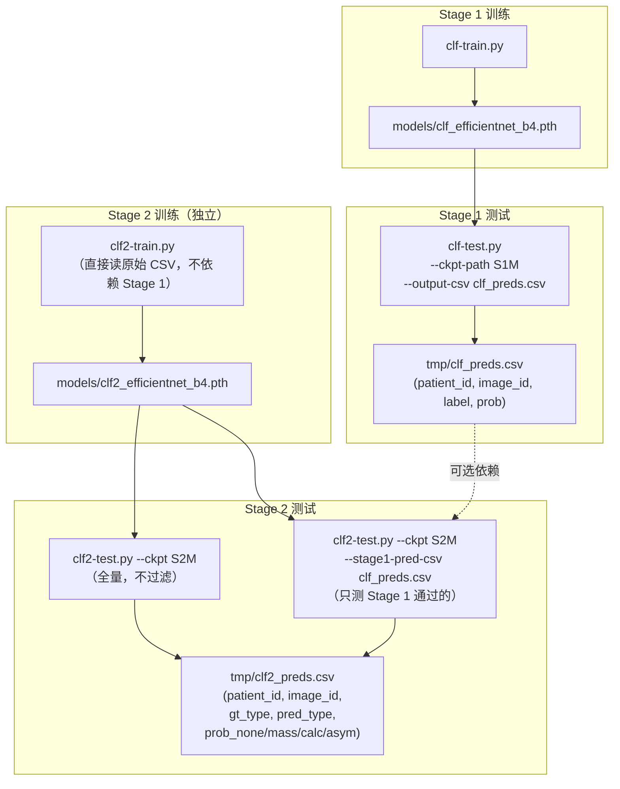

# MammoPearl 深度学习分类系统

> **数据集**：VinDr Mammography（经处理版本）
>
> **方法**：EfficientNet-B4（ImageNet 预训练）两阶段分类流水线
>
> **代码目录**：`src/data/deep-learning/`

---

## 一、整体架构

```
原始乳腺 X 光图像（512×512 RGB）
  │
  ▼
[Stage 1] 图像级二分类筛查
  ├─ 阴性（prob < 阈值）→ 排除，无需进一步分析
  └─ 疑似阳性（prob ≥ 阈值）→ 进入 Stage 2
  │
  ▼
[Stage 2] 四分类病变类型识别
  ├─ 0: No Finding（Stage 1 误报被纠正，或确为阴性）
  ├─ 1: Mass（肿块）
  ├─ 2: Calcification（可疑钙化）
  └─ 3: Asymmetry_Distortion（不对称/结构扭曲，含 Skin_Other）
```

设计原则：
- **Stage 1 高召回优先**：宁可多报也不漏，@阈值 0.10 时召回率 ≥ 95%。
- **Stage 2 精细分类**：在 Stage 1 通过的图像上区分病变类型，也能纠正 Stage 1 误报（No Finding 类）。
- **两个模型独立训练**：Stage 2 不依赖 Stage 1 的权重，仅在推理/测试时通过预测 CSV 串联。

---

## 二、数据集说明

| 项目 | 内容 |
|------|------|
| 原始 CSV | `data/raw/vindr_detection_folds.csv`（约 20,486 行） |
| 图像路径 | `data/processed/images_png/<patient_id>/<image_id>.png` |
| 划分方式 | 患者级别，零重叠 |
| 训练集 | ~16,000 张（split="training"），5 折交叉验证 |
| 测试集 | ~4,000 张（split="test"） |
| 关键标签列 | `has_lesion`（Stage 1），`finding_categories`（Stage 2） |

**Stage 1 标签分布**

| 标签 | 训练集 | 测试集 |
|------|--------|--------|
| 0（阴性） | ~14,600 | 3,616 |
| 1（阳性） | ~1,400  | 384   |

**Stage 2 标签分布（4 类，图像级聚合）**

| 标签 | 含义 | 训练集 | 测试集 |
|------|------|--------|--------|
| 0 | No Finding | ~14,600 | 3,643 |
| 1 | Mass | 817 | 197 |
| 2 | Calcification | 217 | 74 |
| 3 | Asymmetry_Distortion | 377 | 86 |

多病变图像采用优先级规则取主要类型：**Mass > Calcification > Asymmetry_Distortion**。

---

## 三、代码文件说明

```
src/data/deep-learning/
├── dataset.py         # 公共数据集工具（两阶段共用）
├── clf-train.py       # Stage 1 训练脚本
├── clf-test.py        # Stage 1 测试脚本
├── clf2-train.py      # Stage 2 训练脚本
└── clf2-test.py       # Stage 2 测试脚本
```

### 3.1 `dataset.py`（公共）

| 函数 | 用途 |
|------|------|
| `build_image_label_df(csv, split, fold_val, is_val)` | Stage 1 二分类 DataFrame（label=0/1，来自 `has_lesion`） |
| `build_lesion_type_df(csv, split, fold_val, is_val)` | Stage 2 四分类 DataFrame（label=0/1/2/3，来自 `finding_categories`） |
| `build_risk_label_df(csv, split, fold_val, is_val)` | BI-RADS 三分类 DataFrame（备用，来自 `breast_birads`） |
| `compute_sample_weights(img_df)` | Stage 1 WeightedRandomSampler 权重 |
| `compute_sample_weights_multiclass(img_df)` | Stage 2 WeightedRandomSampler 权重（任意类数） |
| `MammoDataset` | 通用 PyTorch Dataset，letterbox 缩放，支持数据增强 |
| `compute_pos_weight(img_df)` | Stage 1 BCEWithLogitsLoss 的正类权重（目前固定为 1.0） |

### 3.2 `clf-train.py`（Stage 1）

**模型**：EfficientNet-B4，输出 1 个 logit（BCEWithLogitsLoss）

**关键设计**：
- `pos_weight = 1.0`（WeightedRandomSampler 已平衡，不叠加权重）
- Checkpoint 判据：动态最优阈值 + trivial_f2 基线过滤（排除全正退化态）
- 进度条格式：`[====    ] 50.0% loss=0.6234`

**定义的函数（供 clf-test.py 动态导入）**：
- `build_model(pretrained, in_channels)` → EfficientNet-B4 with 1-class head
- `evaluate(model, loader, device, amp)` → 多阈值 Recall/Prec/F2/F1/TP/FP/FN

### 3.3 `clf-test.py`（Stage 1 测试）

- 动态导入 `clf-train.py` 以获取 `build_model`、`evaluate`
- 多阈值扫描（0.05 ~ 0.95），输出对齐表格
- 可选 GradCAM 可视化（`--vis-dir`）
- 可选预测 CSV 输出（`--output-csv`）

### 3.4 `clf2-train.py`（Stage 2）

**模型**：EfficientNet-B4，输出 4 个 logits（CrossEntropyLoss，uniform weight）

**关键设计**：
- `WeightedRandomSampler` 平衡 4 类；不额外使用 class weight（避免双重过补偿）
- Checkpoint 判据：类别 1/2/3（Mass/Calc/Asym）的 macro F1
- No Finding（类别 0）不参与 Checkpoint 判据，避免被多数类主导

**定义的函数（供 clf2-test.py 动态导入）**：
- `build_stage2_model(pretrained, num_classes)` → EfficientNet-B4 with 4-class head
- `evaluate_stage2(model, loader, device, amp)` → per-class TP/FP/FN/Recall/Prec/F1 + target_score

### 3.5 `clf2-test.py`（Stage 2 测试）

- 动态导入 `clf2-train.py` 以获取 `build_stage2_model`、`evaluate_stage2`
- 可选 Stage 1 过滤（`--stage1-pred-csv`）
- 可选预测 CSV 输出（`--output-csv`）

---

## 四、文件与产出物依赖关系



> 实线箭头为必要依赖，虚线为可选依赖（仅在使用 `--stage1-pred-csv` 时需要）。

**源码级依赖**（import 关系）：

| 脚本 | 依赖文件 | 依赖方式 |
|------|----------|----------|
| `clf-train.py` | `dataset.py` | 直接 import |
| `clf-test.py` | `dataset.py` | 直接 import |
| `clf-test.py` | `clf-train.py` | 动态 import（`importlib`） |
| `clf2-train.py` | `dataset.py` | 直接 import |
| `clf2-test.py` | `dataset.py` | 直接 import |
| `clf2-test.py` | `clf2-train.py` | 动态 import（`importlib`） |

---

## 五、完整训练-测试闭环命令

### 5.1 Stage 1

```bash
# ── 训练 ────────────────────────────────────────────────────────────────────
python src/data/deep-learning/clf-train.py \
    --epochs 30 \
    --batch-size 16 \
    --lr 1e-4 \
    --encoder-lr-multiplier 0.1 \
    --input-h 512 \
    --input-w 512 \
    --fold-val 0 \
    --patience 8 \
    --save-path models/clf_efficientnet_b4.pth \
    --amp \
    --augment

# ── 测试（多阈值评估 + 预测 CSV）─────────────────────────────────────────────
python src/data/deep-learning/clf-test.py \
    --ckpt-path models/clf_efficientnet_b4.pth \
    --output-csv tmp/clf_preds.csv

# ── 测试（附带 GradCAM 可视化，适合小批量抽查）────────────────────────────────
python src/data/deep-learning/clf-test.py \
    --ckpt-path models/clf_efficientnet_b4.pth \
    --output-csv tmp/clf_preds.csv \
    --vis-dir tmp/gradcam \
    --score-threshold 0.5
```

### 5.2 Stage 2

```bash
# ── 训练 ────────────────────────────────────────────────────────────────────
python src/data/deep-learning/clf2-train.py \
    --epochs 30 \
    --batch-size 16 \
    --lr 1e-4 \
    --encoder-lr-multiplier 0.1 \
    --input-h 512 \
    --input-w 512 \
    --fold-val 0 \
    --patience 10 \
    --save-path models/clf2_efficientnet_b4.pth \
    --amp \
    --augment

# ── 测试（全量评估，不依赖 Stage 1）─────────────────────────────────────────
python src/data/deep-learning/clf2-test.py \
    --ckpt-path models/clf2_efficientnet_b4.pth \
    --output-csv tmp/clf2_preds.csv

# ── 测试（模拟完整流水线：仅评估 Stage 1 通过的图像）──────────────────────────
python src/data/deep-learning/clf2-test.py \
    --ckpt-path models/clf2_efficientnet_b4.pth \
    --stage1-pred-csv tmp/clf_preds.csv \
    --stage1-threshold 0.1 \
    --output-csv tmp/clf2_preds.csv
```

### 5.3 完整流水线（按顺序执行）

```bash
# Step 1: Stage 1 训练
python src/data/deep-learning/clf-train.py \
    --epochs 30 --batch-size 16 --lr 1e-4 \
    --encoder-lr-multiplier 0.1 --input-h 512 --input-w 512 \
    --fold-val 0 --patience 8 \
    --save-path models/clf_efficientnet_b4.pth \
    --amp --augment

# Step 2: Stage 1 测试（生成供 Stage 2 过滤用的预测 CSV）
python src/data/deep-learning/clf-test.py \
    --ckpt-path models/clf_efficientnet_b4.pth \
    --output-csv tmp/clf_preds.csv

# Step 3: Stage 2 训练（独立，不依赖 Step 1/2）
# 可与 Step 1/2 并行运行
python src/data/deep-learning/clf2-train.py \
    --epochs 30 --batch-size 16 --lr 1e-4 \
    --encoder-lr-multiplier 0.1 --input-h 512 --input-w 512 \
    --fold-val 0 --patience 10 \
    --save-path models/clf2_efficientnet_b4.pth \
    --amp --augment

# Step 4: Stage 2 测试（模拟完整流水线）
python src/data/deep-learning/clf2-test.py \
    --ckpt-path models/clf2_efficientnet_b4.pth \
    --stage1-pred-csv tmp/clf_preds.csv \
    --stage1-threshold 0.1 \
    --output-csv tmp/clf2_preds.csv
```

> **提示**：Step 1/2 与 Step 3 可并行训练（两个模型不互相依赖），  
> 只有 Step 4 必须等待 Step 2（获得 `tmp/clf_preds.csv`）和 Step 3 完成后才能运行。

---

## 六、完整运行后的所有产出物

| 产出物路径 | 生成步骤 | 内容描述 |
|-----------|----------|----------|
| `models/clf_efficientnet_b4.pth` | Stage 1 训练 | 最优 val F2 的 Stage 1 checkpoint |
| `models/clf_efficientnet_b4.history.json` | Stage 1 训练 | 每轮 loss/lr/val 指标历史 |
| `models/clf2_efficientnet_b4.pth` | Stage 2 训练 | 最优 lesion macro F1 的 Stage 2 checkpoint |
| `models/clf2_efficientnet_b4.history.json` | Stage 2 训练 | 每轮 loss/lr/val 指标历史 |
| `tmp/clf_preds.csv` | Stage 1 测试 | 每张测试图的预测概率（patient_id, image_id, label, prob） |
| `tmp/gradcam/*.jpg`（可选） | Stage 1 测试 | GradCAM 热力图可视化（高置信度预测） |
| `tmp/clf2_preds.csv` | Stage 2 测试 | 每张测试图的预测类型（patient_id, image_id, gt_type, pred_type, prob_none, prob_mass, prob_calc, prob_asym） |

---

## 七、模型架构说明

两个阶段均使用 **EfficientNet-B4**（torchvision，ImageNet 预训练），
仅分类头不同：

| | Stage 1 | Stage 2 |
|--|---------|---------|
| 输入通道 | 3（RGB）或 4（RGB + GT mask） | 3（RGB） |
| 分类头输出 | 1 logit | 4 logits |
| 损失函数 | BCEWithLogitsLoss（pos_weight=1.0） | CrossEntropyLoss（uniform weight） |
| 类别平衡 | WeightedRandomSampler | WeightedRandomSampler |
| 输入尺寸 | 512×512（letterbox 缩放） | 512×512（letterbox 缩放） |
| 优化器 | AdamW（backbone lr × 0.1，head 全速 lr） | AdamW（backbone lr × 0.1，head 全速 lr） |
| 调度器 | CosineAnnealingLR | CosineAnnealingLR |
| Checkpoint 判据 | 动态最优阈值下的 val F2（过滤全正退化态） | 病变类型（类别 1/2/3）macro F1 |

---

## 八、训练结果参考（已训练版本）

### Stage 1（Epoch 22，30 轮最优）

| 阈值 | Recall | Precision | F2 | FP 数 |
|------|--------|-----------|-----|-------|
| 0.10 | 95.5% | ~11% | — | 2816 |
| 0.30 | ~85%  | ~25% | — | — |
| 0.40 | 63.3% | 25.7% | 0.479 | 704 |

> @0.10 高召回工作点：漏检 16 张（总 356 张阳性），可作为 Stage 2 的输入。

### Stage 2

> 待 Stage 2 训练完成后补充。

---

## 九、常见问题

### Q1：为什么 Stage 2 要训练在全部图像上，而不只是 Stage 1 阳性图像？

Stage 2 包含 No Finding（类别 0）类。如果只训练在阳性图像上，
Stage 2 将永远无法将 Stage 1 误报归还为 No Finding，
会把所有进入 Stage 2 的图像强行分为 Mass/Calc/Asym 三类之一。
训练在全部图像上使 Stage 2 具备"纠正误报"的能力。

### Q2：`--use-gt-mask` 为什么没有在 Stage 2 中使用？

`--use-gt-mask` 在测试时需要提供 GT 分割掩码作为第 4 输入通道，
而真实部署中无法获取 GT 信息（否则已经知道答案了）。
测试时第 4 通道全 0 与训练时阳性样本第 4 通道有值，
会导致分布不一致，反而降低泛化性。

### Q3：两个模型可以同时训练吗？

可以。两个模型训练时互相独立（分别读取原始 CSV）。
只有 Stage 2 测试的"过滤模式"需要等 Stage 1 测试产出 `tmp/clf_preds.csv`。

### Q4：为什么不再使用双重 class weight（WeightedRandomSampler + class_weight）？

实验发现两者叠加会造成过补偿，导致模型预测全部倒向少数类
（Stage 1 全正预测，F2 虚高）。使用 WRS 后，mini-batch 已近似平衡，
无需再在损失函数中加 class weight。详见：Stage 1 修复记录。
